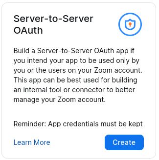
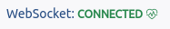

# Zoom WebSocket Event Viewer (ZMWSEV)

> **Note**
> 
> The following sample application is a personal, open-source project shared by the app creator and not an officially supported Zoom Video Communications, Inc. sample application. Zoom Video Communications, Inc., its employees and affiliates are not responsible for the use and maintenance of this application. Please use this sample application for inspiration, exploration and experimentation at your own risk and enjoyment. You may reach out to the app creator and broader Zoom Developer community on https://devforum.zoom.us/ for technical discussion and assistance, but understand there is no service level agreement support for this application. Thank you and happy coding!


This example app uses Node.js + Express to create a Zoom WebSocket event listener and viewer.

# Features
- Docker support
- Supports Zoom x-zm-signature header for event verification. See this [page](https://marketplace.zoom.us/docs/api-reference/webhook-reference/#verify-webhook-events) for details.

## Prerequisites

1. [Docker](https://www.docker.com/)
2. [Zoom Account](https://support.zoom.us/hc/en-us/articles/207278726-Plan-Types-)

## Getting Started

```bash
# Clone this repository
git clone https://github.com/Will4950/zmwsev.git

# Navigate into the cloned project directory
cd zmwsev

# Build docker images
docker-compose build

# Start the container
docker-compose up
```

## Configuration

### Zoom Marketplace

- Open a browser and navigate to https://marketplace.zoom.us/develop/create to begin creating a new Zoom app.

- Select Server-to-Server OAuth

    

- On the 'Information' tab, enter an App name, Company Name, Developer Contact Name, and a Developer Contact Email address.

- On the 'Feature' tab, click to enable 'Event Subscriptions' under the 'General Features' heading.

    

    > Reminder!  The Secret Token can also be found at the top of this tab.
    

- Click the 'Add Event Subscription' button.

- Select the 'WebSocket' radio button.

    

- Click the '+ Add Events' button and select the events you would like to have sent via the WSS Endpoint.

- Click save and enable the app on the 'Activation' tab.

### ZMWSEV

- Open a browser and navigate to http://localhost:8080 to access the event viewer.

- Click the Configuration cog to open the ZMWSEV configuration modal.

    

- Enter your Server-to-Server OAuth Account ID, Client ID, Client Secret, Secret Token, and WSS Endpoint URL.  These values can be found by managing your Server-to-Server OAuth app here: https://marketplace.zoom.us/user/build.

    

### Advanced Configuration

ZMWSEV can be preconfigured so the values do not need to be entered on every restart.  Use the .env file to set defaults.

- Open the .env file in a text editor.  Paste your values in the file and save it.  Rebuild the docker image with `docker-compose build`.

    Example .env file:
    ``` 
    DEBUG=true
    wssEndpoint=wss://ws.zoom.us/ws?subscriptionId=St0pz5tOGDcSisnhtdInjw
    clientID=y5lC4Py6vANwBVcwIjYFRd
    clientSecret=VflsN4HjDFetF4Wzn2O76SUAlGzuCyEC
    accountID=GfsPl083Sqi2AwzbvhD3rw
    secretToken=fUT2UTn-KSLi6o4rB8GSAQ
    ```
    > replace these values with your own

- Events can also be forwarded to ElasticSearch indices.  Add the follwing to the .env file to enable this feature:
    ```
    elastic=true
    elasticCloudID=
    elasticApiKey=
    elasticIndex=
    ```

## Usage

- Heartbeats will automatically be sent to keep the WebSocket connection alive.  The heart icon will blink when a heartbeat is sent.

    

- ZMWSEV will always try and connect the WebSocket client if it is disconnected.  

- If something seems weird, just refresh the page.
